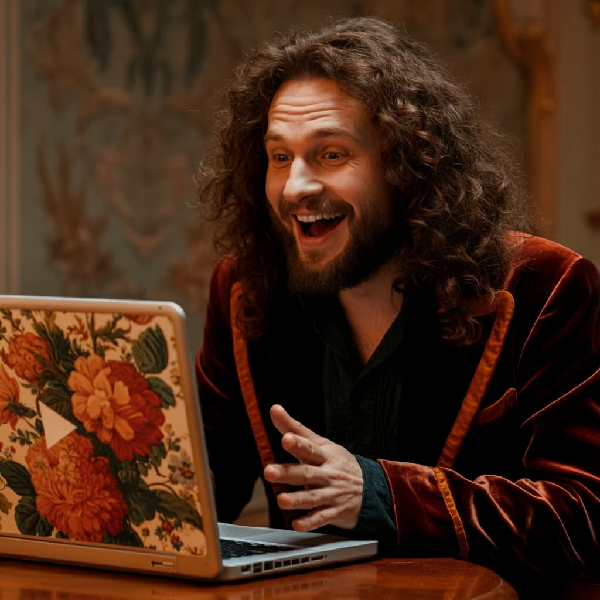

# YouTube 💬 Chat (Lightweight Video RAG)


YouTube 💬 Chat is a Flask-based web application that allows users to ask questions about the content of YouTube videos and receive timestamped YouTube links to the exact moment in the video where the answer is discussed. 

The application processes YouTube video transcripts, generates embeddings, and stores them in a ChromaDB vector store. It then retrieves relevant transcript segments using a retrieval-augmented generation (RAG) approach and provides a direct YouTube link with the exact timestamp for the user's query.

## Features

- **YouTube Transcript Processing:** Automatically downloads and processes the transcript for a given YouTube video ID.
- **Question-Answering:** Accepts user questions and retrieves the most relevant segment from the video transcript.
- **Timestamped YouTube Links:** Provides a direct link to the point in the video where the answer is discussed.
- **ChromaDB Integration:** Uses ChromaDB as the vector store to store and retrieve embeddings.
- **Embed Model:** Utilizes the FastEmbedEmbeddings model to create embeddings for transcript chunks.
- **Language Model:** Integrates with ChatGroq (Llama3-70b-8192) for generating the answer to user queries.

> 📝 **Photo Prompt:** Romanticism painting of happy man talking to a video on a laptop
> **Created with:** [Imagen 3](https://deepmind.google/technologies/imagen-3/)

## Project Structure

```
.
├── app.py                  # Flask application
├── embed_upload.py         # Handles YouTube transcript processing and embedding
├── retrieve_create.py      # Handles the question-answer retrieval and link creation
├── templates/
│   └── index.html          # HTML template for the front-end
├── static/
│   ├── css/
│   │   └── styles.css      # CSS for styling the front-end
│   ├── js/
│   │   └── script.js       # JavaScript for front-end logic
│   └── favicon.ico         # Favicon for the website
├── chromadb/               # Directory where ChromaDB vector store is stored
├── .env                    # Environment variables for API keys and configurations
└── Dockerfile              # Dockerfile for containerizing the application
```

## Getting Started

### Installation

1. **Clone the repository:**

   ```bash
   git clone https://github.com/cloud-ray/youtube-rag.git
   cd youtube-rag
   ```

2. **Install dependencies:**

   Create and activate a virtual environment (optional but recommended):

   ```bash
   python3 -m venv venv
   source venv/bin/activate
   ```

   Install the required Python packages:

   ```bash
   pip install -r requirements.txt
   ```

3. **Set up environment variables:**

   Create a `.env` file in the root directory of the project and add your API keys:

   ```bash
   GROQ_API_KEY=<your-groq-api-key>
   LANGSMITH_TRACING=<your-langsmith-tracing>
   LANGCHAIN_ENDPOINT=<your-langchain-endpoint>
   LANGCHAIN_API_KEY=<your-langchain-api-key>
   LANGCHAIN_PROJECT=<your-langchain-project>
   ```

### Running the Application

1. **Run the Flask application:**

   ```bash
   python app.py
   ```

2. **Access the application:**

   Open your web browser and go to `http://localhost:8080`.

## Usage

- Enter the YouTube video ID and your question in the provided form.
- Click "Get the Answer" to receive the timestamped link to the answer in the video.

## Future Improvements

- Implement user authentication and session management.
- Add support for processing multiple languages.
- Find a different solution for accessing YouTube transcripts.

## Contributing

Contributions are welcome! Please submit a pull request or open an issue to discuss potential changes.

## License

This project is licensed under the MIT License. See the `LICENSE` file for more details.

## Contact

For any questions or comments, please contact [Ray](https://www.linkedin.com/in/raymond-fuorry).